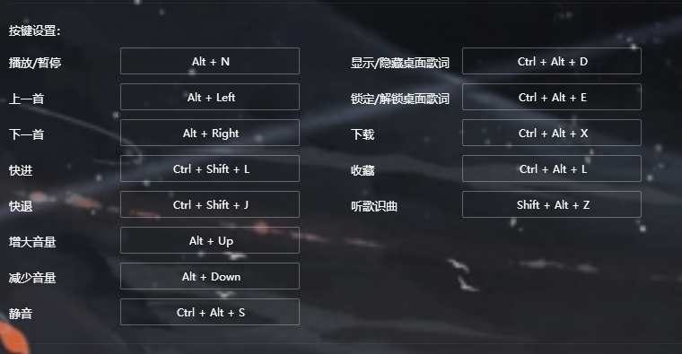

# 99 Kugou Music Remote Controller

### [中文版本](https://github.com/windows99-hue/99KugouMuzicController/blob/main/readme.md)

#### This program allows you to conveniently control Kugou Music on your PC from your phone, tablet, or even HomePod, enabling functions such as pause, play, and song recognition.

## Demo Video

[Video](https://github.com/windows99-hue/99KugouMuzicController/blob/main/video.mp4)

## Deployment

#### Please deploy this program using Python 3.

1. **Download the repository and install required libraries**:

   ```bash
   pip install -r requirement.txt
   ```

2. **Modify the program**:

   - Change the path in line 8 of `main.py`

     ```python
     with open(r"your_desired_path\flask_app.log", "w") as f:
     ```

     Replace `your_desired_path` with your preferred path. The `flask_app.log` file stores the log of the Flask server. Since this program runs in `pythonw`, all console output is redirected to `flask_app.log`. This file is cleared each time the program is restarted.

   - Change the path in line 45 of `main.py`

     ```python
     os.system("start \"\" \"<your path of Kugou Music>\"")
     ```

     Replace `<your path of Kugou Music>` with the path to your `Kugou.exe`. Note: If there are spaces in the path, use the template provided.

   - Change the `port` parameter in line 101 of `main.py`

     ```python
     app.run(host="0.0.0.0", debug=False, port=your_desired_port)
     ```

     Replace `your_desired_port` with the port you want the Flask server to run on. The default is 52099. Ensure that your firewall allows the port you have chosen.

3. **Modify the BAT file**:

   Change the path in `start_server.bat`

   ```bat
   start "" pythonw -u "<your absolute path of main.py>"
   ```

   Replace `<your absolute path of main.py>` with the absolute path to `main.py`. You can place `start_server.bat` in `C:\ProgramData\Microsoft\Windows\Start Menu\Programs\Startup` to make it start automatically when the computer boots.

4. **Install the APK file**:

   Install `99KugouMusicController.apk` on your device.

5. **Modify hotkeys**:

   - Start Kugou Music and go to settings, then hotkey settings.
   - Enable global hotkeys in `Hotkey Settings`.
   - Modify the hotkeys according to the image provided.

   

   If my set hotkeys conflict with yours, you can change them in lines 43-87 of `main.py`, for example:

   ```python
   elif(q == "stoporstart"):
       hk("alt", "n")
   ```

   Or for conditional hotkeys:

   ```python
   elif(q == "fastforward"):
       if not qp:
           return "Cannot Found Args Called qp"
   ```

## Running the Program

Start the server via `start_server.bat`. It's recommended to run `python main.py` first to check for errors.

On first startup, change the server address `<your ip>:<your port>` in the app.

Try each option after making changes. Some options require additional parameters: for fast forward/backward, the parameter represents the time in seconds; for volume up/down, the parameter represents the percentage change.

## Usage Disclaimer

This program uses the MIT license. The algorithms have some flaws and may be updated in the future. This program can also be adapted for other software since it relies on hotkeys. I may open-source the app in the future, so stay tuned.
